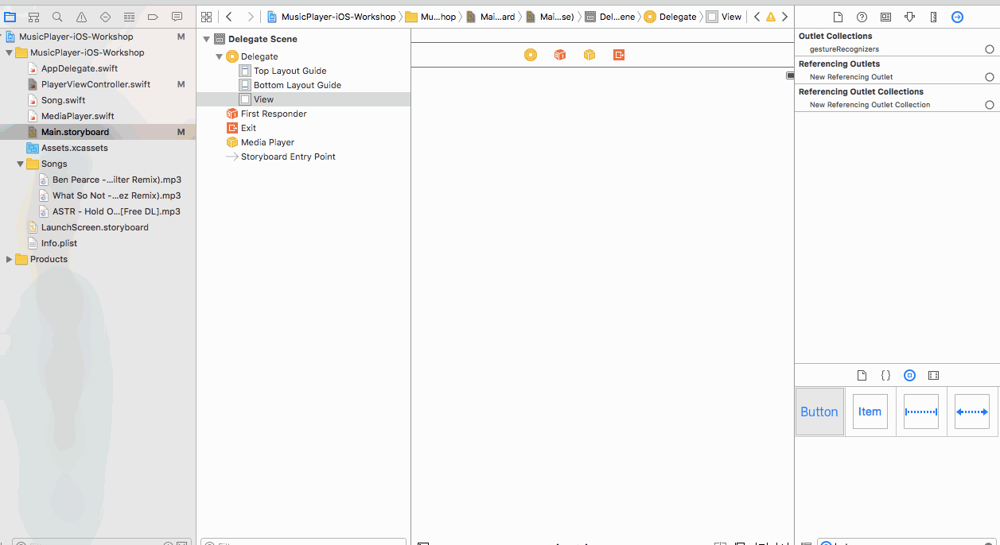
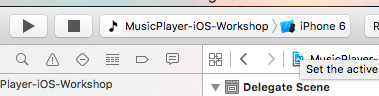
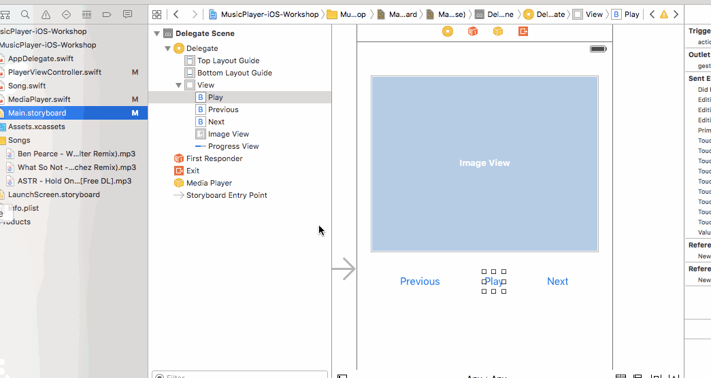
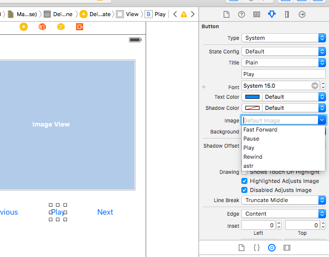
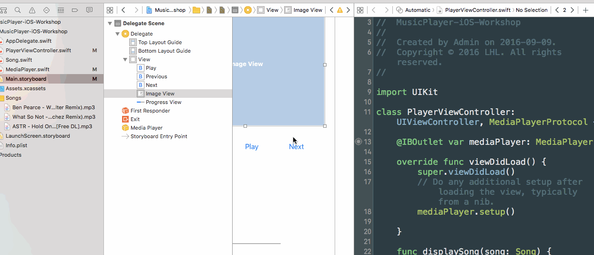
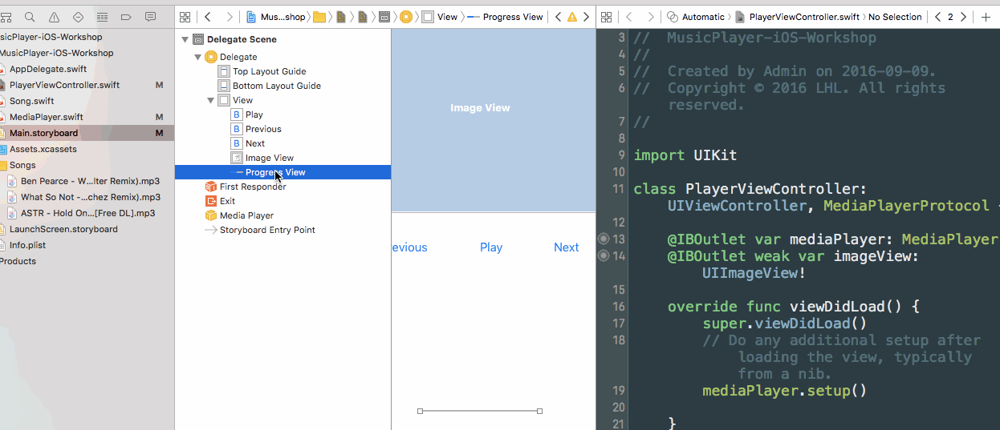

## iOS Music Swift Workshop

## Part 1

- Download the Zip


- Unzip the folder

- Open up Xcode project file "MusicPlayer-iOS-Workshop.xcodeproj".

- Go to Main.playground

- You can add UI elements by dragging them over from the right hand menu.



- Add a Play Button, A Previous Button, and a Next Button to your screen.

- Run the app on your simulator (or iOS device) by clicking the Play icon on Xcode



- Right now the buttons do nothing when clicked, but lets hook it up to code (that has already been written). Here is a demo of connecting the play button to run code written to play a song.



- You can also hook up the previous and next song button to code written to perform those functions.

### Bonus

- You can change the Play button to be a Play icon instead of the word play. Click on the Play button and go to the right hand panel to the image option.



- You can even change the color of the text or icons. See if you can find the option which will do that.

## Part 2

- Add an ImageView (to show the song artwork) and a Progress View (to show the current songs progress) to your screen.

- To get the ImageView to work, you have to connect it up as an IBOutlet (so we can refer to that UIKit element in code). Call the IBOutlet imageView



- To get the ProgressView to work, connect it up as an IBOutlet. Call it progressView



Lastly, we need to change code in the "PlayerViewController.swift" file.

We change 

```
    func displaySong(song: Song) {
        
    }

```

to 

```
    func displaySong(song: Song) {
        imageView.image = song.image
    }

```
ie) show the image of the current song being played

For the progressView we change:

```
func displayCompletionPercentage(percentComplete: Float) {

    }

```
to

```
func displayCompletionPercentage(percentComplete: Float) {
        progressView.progress = percentComplete
    }

```


Run the app. And enjoy the music.
